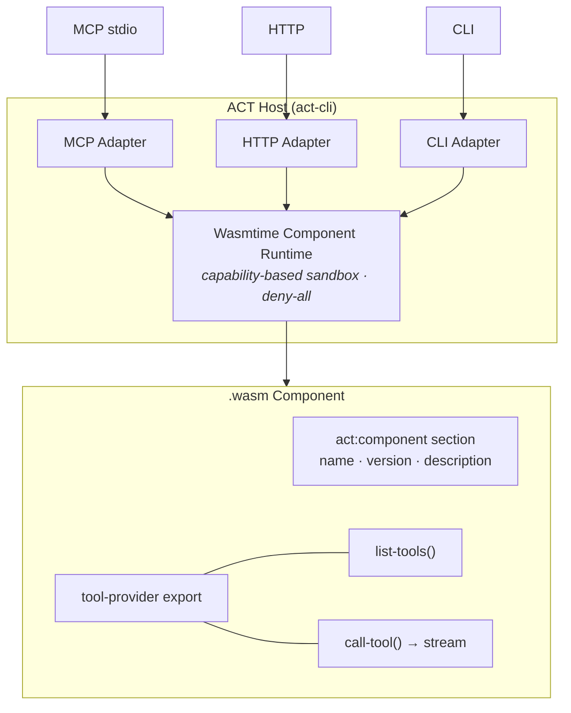

# ACT: Agent Component Tools

A self-documenting RPC protocol for AI agent tools, built on the [WebAssembly Component Model](https://component-model.bytecodealliance.org/).

A single `.wasm` component serves AI agents (via [MCP](spec/ACT-MCP.md)), application developers (via [HTTP+JSON/CBOR](spec/ACT-HTTP.md)), CLI users, and browsers — with hardware-enforced sandboxing by default.

## Why ACT

**Universal tools, not framework-locked plugins.** Write a tool once as a Wasm component. Run it from Claude, GPT, Gemini, your own orchestrator, a REST client, or the command line. The host adapts the transport — the component doesn't change.

**Secure by construction.** Components run in WebAssembly's capability-based sandbox. No filesystem, network, or system access unless the operator explicitly grants it. This isn't a policy layer that can be bypassed — it's enforced by the runtime.

**Self-describing.** Component metadata, tool schemas, and usage instructions are embedded in the `.wasm` binary. `act info --tools component.wasm` tells you everything — no external docs or API keys needed to discover what a component does.

**Streaming and async.** Every tool call returns `stream<stream-event>`, so components can emit progress, partial results, and structured errors incrementally. Built on WASI Preview 3 native async.

## Specification

| Document | Description |
|----------|-------------|
| [ACT-SPEC](spec/ACT-SPEC.md) | Core protocol specification (normative) |
| [ACT-SESSIONS](spec/ACT-SESSIONS.md) | Stateful sessions (normative) |
| [ACT-HTTP](spec/ACT-HTTP.md) | HTTP API binding (normative) |
| [ACT-CONSTANTS](spec/ACT-CONSTANTS.md) | Well-known `std:` constants registry (normative) |
| [ACT-MCP](spec/ACT-MCP.md) | MCP adapter mapping guide (informative) |
| [ACT-AUTH](spec/ACT-AUTH.md) | Authentication (normative) |
| [ACT-AGENTSKILLS](spec/ACT-AGENTSKILLS.md) | Agent Skills embedding (normative) |
| [OpenAPI](spec/ACT-HTTP-openapi.yaml) | OpenAPI 3.2 definition for ACT-HTTP |

WIT interfaces: [`wit/`](wit/)

## Architecture



### Tool Call Flow

```mermaid
sequenceDiagram
    participant Client
    participant Host as ACT Host
    participant Wasm as .wasm Component

    Client->>Host: tools/call (MCP, HTTP, or CLI)
    Host->>Host: Validate args against JSON Schema
    Host->>Wasm: call-tool(tool-call)
    loop stream&lt;stream-event&gt;
        Wasm-->>Host: content(part) | error(err)
        Host-->>Client: SSE event / MCP response
    end
```

## Quick Start

```bash
# Install the CLI
npm i -g @actcore/act        # or: pip install act-cli / cargo install act-cli

# Inspect a component from the OCI registry
act info --tools ghcr.io/actpkg/sqlite

# Call a tool directly
act call ghcr.io/actpkg/sqlite query \
  --args '{"sql":"SELECT sqlite_version()"}' \
  --metadata '{"database_path":"/tmp/test.db"}' \
  --allow-dir /tmp:/tmp

# Serve over MCP (plug into Claude, Cursor, etc.)
act run --mcp ghcr.io/actpkg/sqlite

# Serve over HTTP
act run -l ghcr.io/actpkg/sqlite
# → http://[::1]:3000/tools/query
```

## Build a Component

```bash
# Install the Rust SDK
cargo add act-sdk

# Build for WebAssembly
cargo build --target wasm32-wasip2 --release

# Embed metadata and package
act-build pack target/wasm32-wasip2/release/my_component.wasm
```

Minimal component with the SDK:

```rust
use act_sdk::prelude::*;

#[act_component("my-tools", version = "0.1.0", description = "Example tools")]
struct MyComponent;

#[act_tool(description = "Say hello")]
fn greet(name: String) -> String {
    format!("Hello, {name}!")
}
```

See the [Rust SDK](https://github.com/actcore/act-sdk-rs) for full documentation and examples. A [Python SDK](https://github.com/actcore/act-sdk-py) is also available.

## Available Components

Components are distributed as OCI artifacts from `ghcr.io/actpkg/`.

| Component | Description |
|-----------|-------------|
| [sqlite](https://github.com/actpkg/sqlite) | SQLite database with vector search |
| [filesystem](https://github.com/actpkg/filesystem) | Sandboxed file system operations |
| [http-client](https://github.com/actcore/component-http-client) | HTTP fetch |
| [crypto](https://github.com/actpkg/crypto) | Hashing, HMAC, encryption |
| [encoding](https://github.com/actpkg/encoding) | Base64, hex, URL encoding |
| [random](https://github.com/actpkg/random) | Secure random generation, UUIDs |
| [time](https://github.com/actcore/component-time) | Date/time utilities |
| [python-eval](https://github.com/actpkg/python-eval) | Python code evaluation |
| [openwallet](https://github.com/actpkg/openwallet) | Crypto wallet operations |
| [mcp-bridge](https://github.com/actcore/component-mcp-bridge) | Bridge to any MCP server |
| [openapi-bridge](https://github.com/actcore/component-openapi-bridge) | Bridge any OpenAPI service |
| [act-http-bridge](https://github.com/actcore/component-act-http-bridge) | Bridge to remote ACT hosts |

## Ecosystem

| Repository | Description |
|------------|-------------|
| **[act-spec](https://github.com/actcore/act-spec)** | This repo — protocol specification and WIT |
| [act-cli](https://github.com/actcore/act-cli) | CLI host (`act` and `act-build` binaries) |
| [act-sdk-rs](https://github.com/actcore/act-sdk-rs) | Rust SDK with proc macros |
| [act-sdk-py](https://github.com/actcore/act-sdk-py) | Python SDK |
| [act-template-rust](https://github.com/actcore/act-template-rust) | `cargo-generate` template for Rust components |
| [act-template-python](https://github.com/actcore/act-template-python) | Template for Python components |

## Status

ACT is in active development. The protocol is at **v0.2.0** with a working host, SDKs in Rust and Python, and 12+ production components. The specification is complete and stable within the 0.2.x line — breaking changes will increment the minor version.

We welcome feedback via [GitHub Issues](https://github.com/actcore/act-spec/issues) and [Discussions](https://github.com/actcore/act-spec/discussions).

## License

Apache-2.0
